<div align="center">


# Rift

**The AI-native terminal that understands your screen.**

Native and fast like Ghostty. Blocks and AI like Warp. Local-first, bring-your-own-key, no account, and a cyberpunk look to go with it.

[](LICENSE)
[](https://www.rust-lang.org)
[](#quickstart)
[](https://ko-fi.com/john5555555555)

[**Website**](https://overkazaf.github.io/rift/) · [Quickstart](#quickstart) · [AI setup](#ai-setup) · [Shortcuts](#keyboard-shortcuts) · [Roadmap](#roadmap)

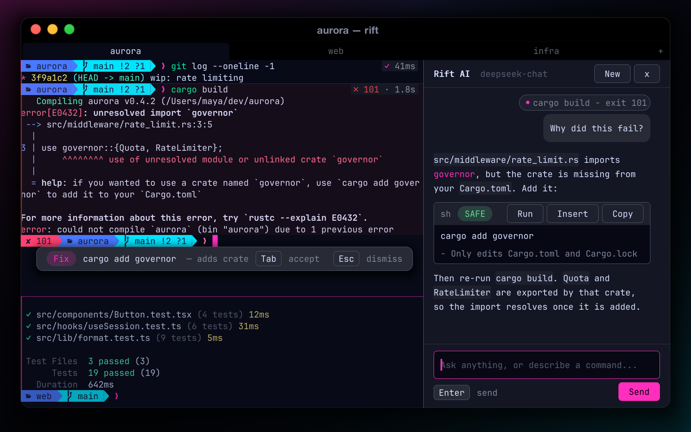

</div>

## Why Rift

- **Native and fast.** Written in Rust. Rendering is damage-tracked, with an optional GPU path: a keystroke frame takes about 6 ms, down from about 42 ms before damage tracking. IME, CJK and Nerd Font fallback are built in.
- **Understands your screen.** Shell integration turns output into command blocks. The AI gets your selection, a block or the whole screen as context, and it never runs a command without you.
- **Yours, locally.** No account and no telemetry. Bring your own key (DeepSeek or any OpenAI-compatible API) or run fully offline with Ollama.

## Features

### Command blocks

Each command and its output form one block. This works through OSC 133 hooks that Rift injects into **zsh, bash and fish** automatically. It never edits your rc files.

- Exit-code gutter, duration and exit-status chips
- Hover toolbar: copy command, copy output, ask AI, rerun, fold
- Fold long output, jump between blocks with `Cmd+Shift+↑/↓`, copy a block's output with `Cmd+Shift+C`

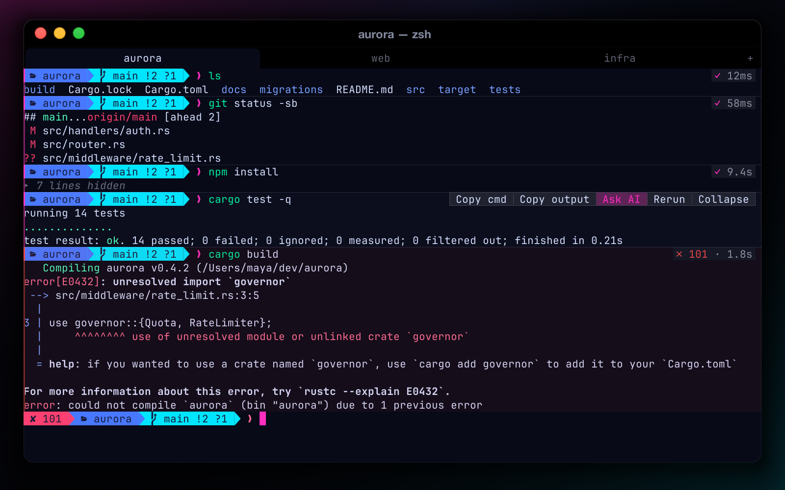

### AI that lives where you work *(preview: under active development)*

| | |
|---|---|
| **Docked AI chat** (`Cmd+Shift+A`): a streaming sidebar next to your panes. Works with OpenAI-compatible APIs (DeepSeek, OpenAI…) and local Ollama. | 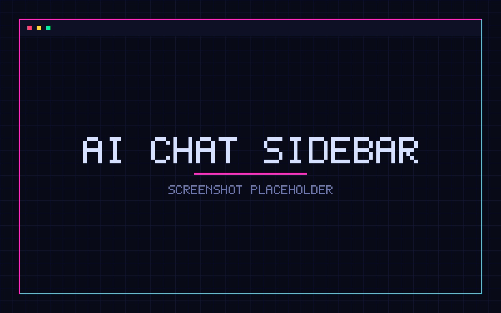 |
| **Ask about this** (`Cmd+K`): a popover anchored to your selection, the hovered block, the last block or the screen. | 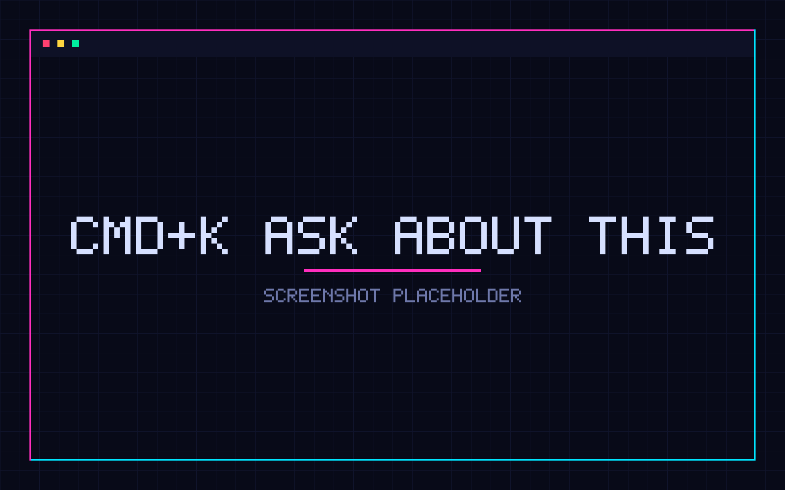 |
| **Inline fixes**: when a command fails, a corrected command appears at the prompt. `Tab` accepts it, `Esc` dismisses it. | 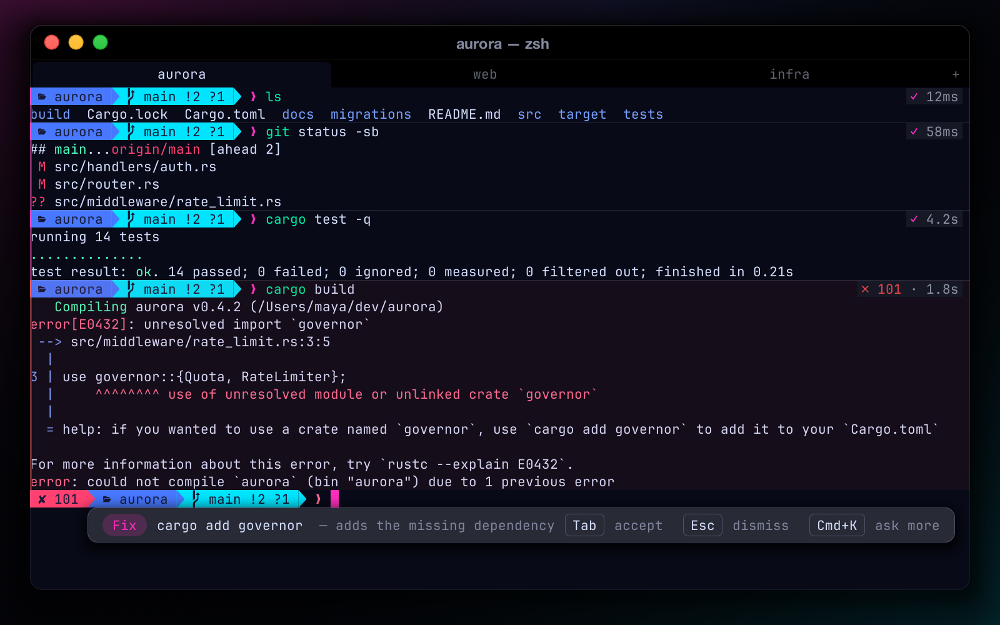 |
| **`# natural language`**: type `# find the 10 largest files` and press Enter. Rift types the generated command back into your prompt so you can review it. It is never executed for you. | 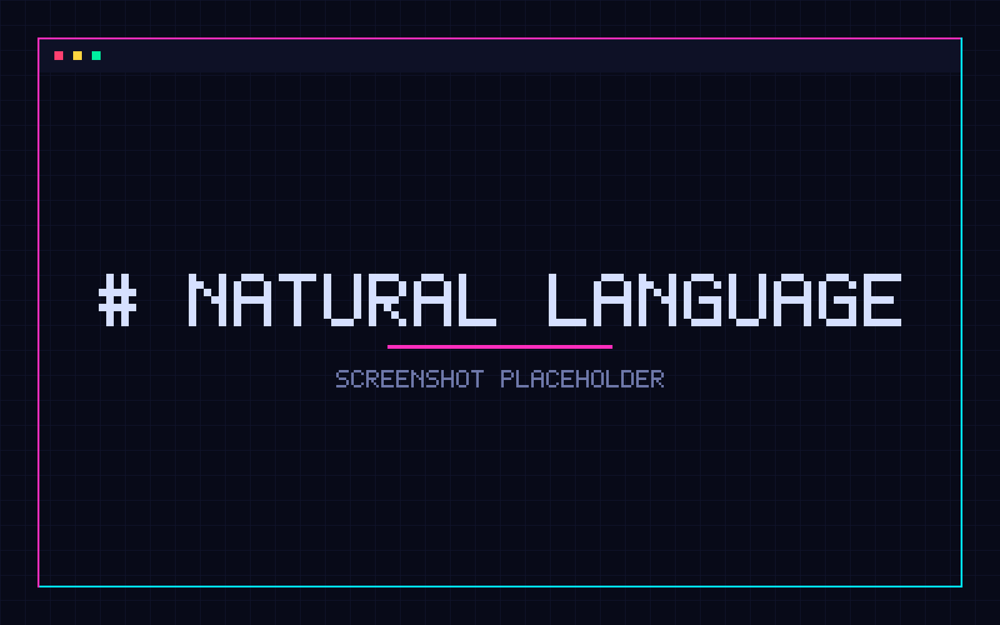 |

Also available: **Advisor** gives a second-opinion risk review of suggested commands. **Teaching mode** explains a command on demand: with it on, type a command at the prompt and press `Cmd+Shift+L` again to get a line-by-line explanation before you run it. **Observer** offers opt-in workflow insights that stay on your machine.

### Preview-Then-Accept

Rift intercepts dangerous commands such as `rm -rf` on important paths, `curl … | sh`, `git reset --hard` and force pushes before they run, and shows a real impact analysis. Routine cleanups like `rm -rf ./build` are not interrupted. Critical commands need a typed "yes".

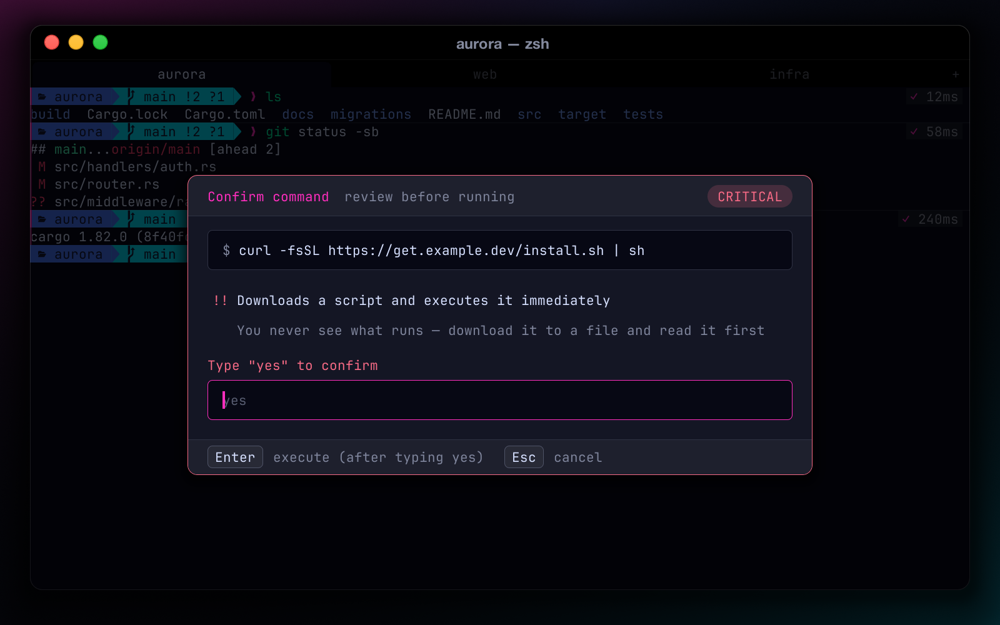

### Splits, tabs and sessions

Recursive splits with geometric focus, zoom, equalize, swap and drag-resize. You can rename and reorder tabs. Session restore brings back your tabs, split layouts and working directories.

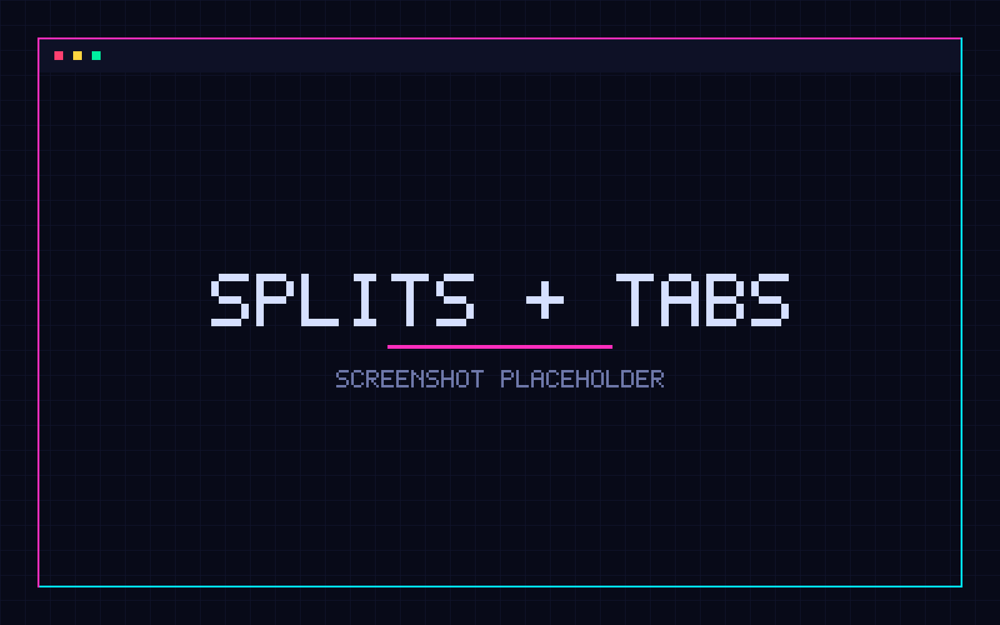

### Command palette and built-in browser

| | |
|---|---|
| **Command palette** (`Cmd+P`): fuzzy search ranked by frecency, plus parameterized commands: `theme`, `font`, `open`, `ssh`, `cd`, `>` (shell), `?` (ask AI). | 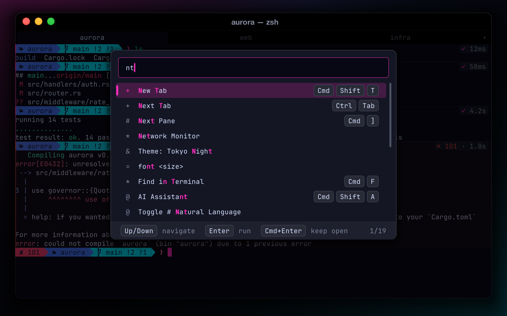 |
| **Built-in browser** (`Cmd+Shift+B`): a resizable docked panel with toolbar and a smart URL-or-search address bar. `Cmd`+click a link to open it inside Rift. | 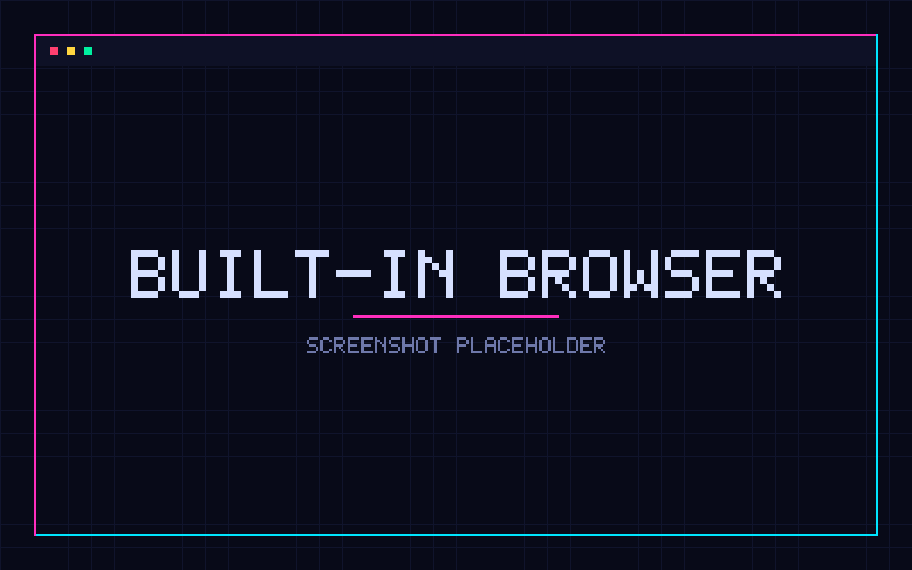 |

### Cyber identity

Six screen effects (**CRT, Neon Glow, Matrix Rain, Hologram, Glitch, Amber**) on `Ctrl+Shift+1…6`. The flagship theme is **`rift-neon`**, and nine more ship with it: catppuccin-mocha, hacker-green, dracula, nord, solarized-dark, tokyo-night, cyberpunk, gruvbox, monokai.

| | |
|---|---|
| 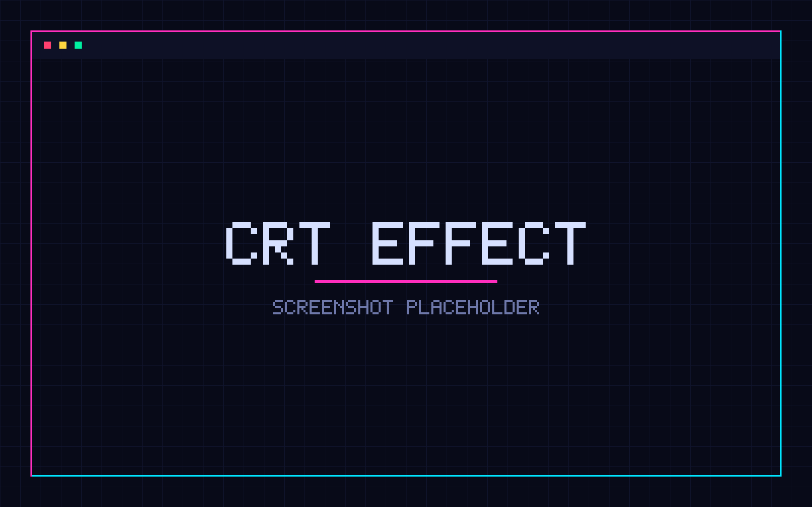 | 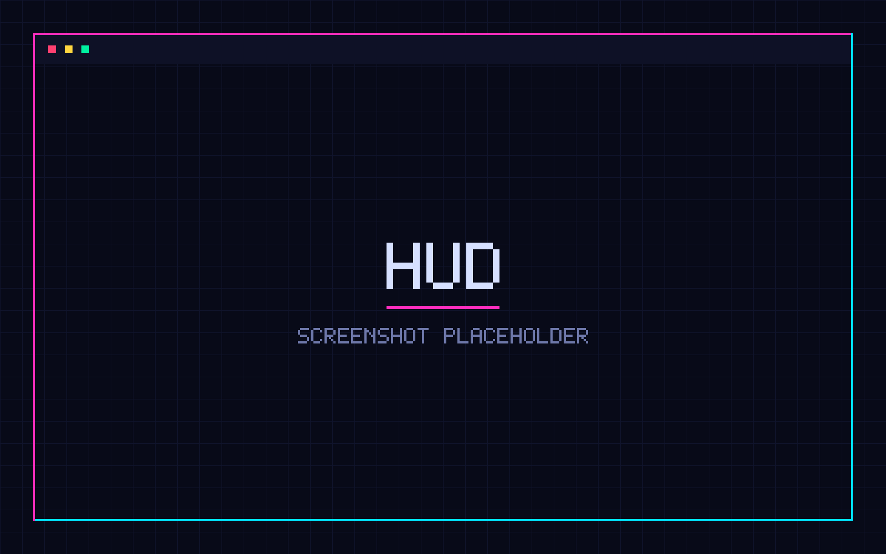 |

### Power tools

SSH manager · Time Warp (rewind the screen) · HUD · Git / Docker / CI panels · Port dashboard · Regex playground · History search (`Cmd+Y`) · asciinema recording · Secret masking · Inline images (Kitty graphics protocol) · Broadcast input · Compare pane output · File manager · Command heatmap · Audit log

### Core

Damage-tracked rendering with an optional wgpu backend · IME (Chinese input) · font fallback (Nerd Font / Powerline / CJK) · shell integration (OSC 133 / OSC 7) · smooth scrolling · rich selection · context menu · Kitty inline images · session restore

## How it compares

Rift is young. The others are excellent and much more mature. This table shows what Rift brings together, and where it is still catching up.

| | **Rift** | Ghostty | Warp | iTerm2 |
|---|---|---|---|---|
| Open source | ✅ MIT | ✅ MIT | ❌ | ✅ GPL |
| Native app | ✅ Rust | ✅ Zig | ✅ Rust | ✅ Obj-C |
| GPU rendering | ◐ optional (wgpu) | ✅ | ✅ | ✅ Metal |
| No account required | ✅ | ✅ | ◐ AI needs login | ✅ |
| Command blocks | ✅ | ❌ | ✅ | ◐ marks |
| Built-in AI chat / NL → command | ◐ preview | ❌ | ✅ | ◐ plugin |
| Bring your own key / local models | ✅ incl. Ollama | — | ◐ | ◐ plugin |
| Dangerous-command preview | ✅ | ❌ | ❌ | ❌ |
| Built-in browser panel | ✅ | ❌ | ❌ | ◐ |
| Screen effects / shaders | ✅ 6 built in | ✅ custom shaders | ❌ | ❌ |
| Platforms | macOS, Linux | macOS, Linux | macOS, Linux, Windows | macOS |
| Maturity | Early (v0.3) | Stable | Stable | Very mature |

<sub>✅ yes · ◐ partial / in progress · ❌ no. Based on our reading of each project's public docs as of 2026. If something is wrong, please open an issue.</sub>

## Quickstart

You need a stable Rust toolchain. Prebuilt binaries will be published on [Releases](https://github.com/overkazaf/rift/releases).

```bash
git clone https://github.com/overkazaf/rift.git
cd rift
cargo build --release --features gpu,webview
./target/release/rift
```

macOS app bundle (creates `target/Rift.app`):

```bash
./scripts/bundle_macos.sh
open target/Rift.app
```

| Feature flag | What it adds |
|---|---|
| `gpu` | wgpu renderer: glyph-atlas text on the GPU, ligatures, GPU effects |
| `webview` | Built-in browser panel (system WebView; needs WebKitGTK on Linux) |
| `plugins` | Experimental WASM plugin host (wasmtime) |

```bash
rift --help            # usage
rift --version
rift --config PATH     # use a specific config file
```

## AI setup

Config lives at `~/.config/rift/config.toml` (or the file given with `--config PATH`). AI stays off until you configure an `[llm]` section or answer the one-time consent prompt. If `api_key` is omitted from `[llm]`, Rift reads `$DEEPSEEK_API_KEY` or `$OPENAI_API_KEY` from the environment. A key in the environment alone never turns cloud AI on: Rift asks first, and records your answer as `[ai] consent = "cloud" | "local" | "declined"`.

**DeepSeek** (or any OpenAI-compatible API):

```toml
[llm]
provider = "openai"          # any OpenAI-compatible endpoint
model    = "deepseek-chat"
api_url  = "https://api.deepseek.com"
# api_key = "..."            # optional; falls back to $DEEPSEEK_API_KEY
```

**OpenAI:**

```toml
[llm]
provider = "openai"
model    = "gpt-4o-mini"
api_url  = "https://api.openai.com"
```

**Ollama** (fully local, no key):

```toml
[llm]
provider = "ollama"
model    = "llama3.2"
api_url  = "http://localhost:11434"
```

Turn the ambient AI features on or off:

```toml
[ai]
auto_fix = true   # suggest a fix when a command fails (off until you consent to AI)
nl_hash  = true   # "# ..." at the prompt → generated command
```

Settings changed in Rift are merged into your file: comments, unknown keys and your `api_key` are left untouched, and nothing is written unless a setting actually changed.

Clipboard access by programs (OSC 52):

```toml
[security]
osc52 = "write-only"   # default: programs may set the clipboard (<=100 KB, with a toast), never read it
# osc52 = "allow"      # reads and writes
# osc52 = "deny"       # neither
```

Other `[general]` keys: `theme` (default `"rift-neon"`), `font_family`, `font_path`, `font_size`, `opacity`, `cols`, `rows`, `effect`, `effect_intensity`, `startup_animation`. You can also open **Preferences** (`Cmd+,`).

#### Rendering

```toml
[general]
renderer = "auto"        # "auto" | "gpu" | "cpu": builds with --features gpu draw the terminal on the GPU
                         # (glyph atlas + instanced quads); "cpu" or a missing GPU falls back to the software renderer
font_ligatures = true    # programming ligatures (-> => != ...). Default: on with the GPU renderer, off on CPU.
                         # Needs a font that ships them, e.g. JetBrains Mono / Fira Code via font_path or font_family.
```

`RIFT_RENDERER=cpu|gpu|auto` overrides `renderer`, and `RIFT_PROFILE=1` prints per-phase frame timings (including the GPU upload phases) every 120 frames.

### Privacy

- No account and no telemetry.
- AI requests go directly from your machine to the endpoint you configure. With Ollama they never leave your machine.
- Screen or block text is sent only for an AI action you trigger, or for auto-fix on failed commands, which you can turn off with `auto_fix = false`.
- Observer is opt-in and stores data locally under `~/.config/rift/observer/`. It skips sensitive commands and never records arguments.
- Cloud AI needs your consent. Nothing is sent until you answer the one-time prompt (or configure `[llm]` yourself), and a key in the environment alone does not turn it on. Secrets are redacted from text before it is sent.
- Programs cannot read your clipboard: OSC 52 reads are blocked by default (`[security] osc52`), and writes are size-capped and announced with a toast.
- SSH checks host keys against `~/.ssh/known_hosts`. An unknown host asks before it is trusted, and a changed key is flagged as a possible man-in-the-middle.

## Use Rift with Claude Code / Codex

Rift has a built-in [MCP](https://modelcontextprotocol.io) server, so coding agents can see what is in your terminal panes and, only with your approval, run commands in them. Rift must be running; `rift mcp` is a small stdio bridge to it.

**Claude Code**

```sh
claude mcp add rift -- rift mcp
```

**Codex** (`~/.codex/config.toml`)

```toml
[mcp_servers.rift]
command = "rift"
args = ["mcp"]
```

Any other MCP client works with `{"command": "rift", "args": ["mcp"]}`. If Rift is not running, `rift mcp` answers every request with a JSON-RPC error that says so.

**Tools**

| Tool | What it does |
| --- | --- |
| `list_panes` | Tabs and panes: id, title, cwd, running command, size, focus (`agent` is reserved, currently `null`) |
| `read_pane` | Last N rows of a pane (optionally with scrollback), ANSI stripped, secrets redacted |
| `list_blocks` / `read_block` | Recent OSC 133 command blocks and one block's command and output (64 KB cap, keeps the end) |
| `search_scrollback` | Case-insensitive search with surrounding lines, most recent first |
| `run_command` | Asks you to approve a command in a pane. Dangerous commands get a critical warning. Only [autopilot](#autopilot--policy) with a matching policy rule can answer it for you; critical commands are never auto-approved |

Resources: `rift://pane/{id}/screen` and `rift://pane/{id}/blocks`.

**Config** (`~/.config/rift/config.toml`)

```toml
[mcp]
enabled = true       # false: no socket at all
allow_run = "ask"    # "never": run_command is not offered
```

**Security**

- The server listens on a Unix socket, `~/.config/rift/mcp.sock` (override with `RIFT_MCP_SOCK`), mode `0600`, and rejects any peer whose UID is not yours.
- Everything an agent reads is stripped of escape codes, passed through the same secret redaction as AI requests, and size-capped. Search runs on the redacted text.
- At most 20 requests per second per client.
- `run_command` shows "Agent wants to run `cmd` in pane N" with Run and Deny; the default is Deny. Commands that `Preview-Then-Accept` classifies as risky or critical show their impact, and critical ones put Deny first. Multi-line commands and invisible or control characters are refused, and so is a pane that is busy, in a full-screen program, or has text typed at the prompt.
- The tab bar shows **MCP · 1 client** while an agent is connected. **Command Palette > MCP Activity** lists every call, including denied ones.
- Terminal output is untrusted input to the agent. Treat anything an agent reads from a pane the way you would treat a pasted web page.

## Mission control for AI agents

Rift is built to supervise AI coding agents: Claude Code, Codex CLI, Gemini CLI, opencode, Aider and Cursor CLI. Run them in any pane; Rift notices, tracks what each one is doing across every tab, and tells you when one needs you.

- **Detection.** From the command you ran (OSC 633;E / command blocks, including `npx @anthropic-ai/claude-code`, `env FOO=1 aider`, `cd x && codex`), then the PTY's foreground process (so aliases and wrapper scripts work), then the window title.
- **States.** Starting, Working, Waiting for you, Idle, Done, Error. Rift infers them from output activity, approval prompts on a quiet screen ("Do you want to proceed?", `1. Yes`, `[y/n]`, Codex "Allow command?", ...), OSC 9 / 777 notifications, command exit, and, most reliably, agent hooks (below).
- **Mission Control dock** (`Cmd+Shift+;`, or *Agents > Mission Control*). A control console on the left edge with one card per agent across all tabs: icon, repo and branch (plus the worktree directory), state pill (working pulses with the accent colour, **needs you** pulses amber, done ✓, error ✗), elapsed time, the last line of output and the metrics below. Click a card to select it, double-click (or `Enter`) to jump to its tab and pane. Drag the dock's right edge to resize it (the width is saved as `[agents] dock_cols`); `Tab` or the icon in the header switches between compact and expanded cards. With no agents it shows a **New Agent…** button and how to set up hooks ([Claude Code hooks](#claude-code-hooks)).
- **Act from the dock.** No pane switching needed:
  - **Approve / deny.** When an agent waits on an approval prompt, its card expands to show what is requested (the shell command, or the file to edit or write) and the buttons the agent offers, `[1 Approve] [2 Always] [3 Deny]`, labelled with the agent's own option numbers. Prompts are parsed from the pane's screen for Claude Code, Codex, Gemini CLI, Aider, opencode and Cursor CLI (table-driven parsers with fixtures in `src/agents/prompt.rs`); if a prompt cannot be parsed the card shows the raw last lines and you answer in the pane. Shell commands are checked with the Preview-Then-Accept rules first: risky ones get a red **RISKY** badge and the first impact, and **critical** ones need a second press (press the same number again or `Enter`). The answer goes through the terminal's own key encoder (digits, `y`/`n`, or arrows + `Enter` as the CLI expects), and Rift re-reads the screen right before sending so a prompt that just changed is never answered blindly.
  - **Interrupt.** `Esc` sends ESC to the selected agent (Claude Code's interrupt); a second `Esc` hands the keyboard back. *Send Ctrl+C* is in the card's context menu (right-click a card or press `m`).
  - **Reply.** `r` opens an inline composer on the selected card. `Enter` sends the text plus Enter to that pane; `Shift+Enter` adds a line break using your `shift_enter` setting. IME input and `Cmd+V` go to the composer.
  - **Broadcast.** `Space` (or `Cmd+click`) marks cards; `b` types once to every marked agent (or to all live agents when none is marked) and asks for confirmation when there is more than one target. Agents waiting on an approval menu are skipped, since typed text would act as menu keys.
  - **Review.** `v` or the **Review** button opens the change-review overlay for that pane; clicking a turn in the card's timeline opens it at that turn.
  - **Restart / close.** `R` stops the agent (if running) and re-runs its original launch command in the same pane (the command text Rift saw, or the default for the agent); `x` closes the pane. Both ask first when work could be lost.
  - Keys at a glance: arrows or `j`/`k` select, `Enter` jump, `1`–`3` answer (otherwise `1`–`9` jump to the Nth agent), `Esc` interrupt, `r` reply, `b` broadcast, `Space` mark, `a` mark all, `c` clear marks, `v` review, `t` task queue, `p` / `P` autopilot (agent / all), `w` always allow this, `f` forward reviewer feedback, `S` stop a workflow loop, `R` restart, `x` close, `m` menu, `Tab` density, `n` next waiting.
- **At a glance.** Each card shows the model, tokens, cost, context-window use and the usage reset time read from the agent's own UI (Claude Code status lines and spinner, Codex footer and `Token usage`, Gemini footer, Aider's token report, opencode's sidebar; parsers and fixtures in `src/agents/metrics.rs`), the files changed in the latest turn and over all turns (from change review), and a compact **turn timeline** (duration, files, outcome). The footer totals cost and tokens across agents and counts those waiting. If two agents run in the same git worktree *and* branch, both cards get an amber **same worktree as …** chip with a hint to use *New Agent > worktree*.
- **Needs you.** `Cmd+Shift+.` jumps to the next agent waiting for you (cycling). Tabs show a badge with the agent count and an amber dot when one is waiting, and a waiting pane gets an amber border.
- **Notifications.** When an agent needs approval or finishes a turn while its pane is not in front of you (or Rift is in the background) you get a macOS notification such as "Claude Code in rift/main needs your approval", plus a dock badge with the number of agents waiting. Notifications are de-duplicated and rate limited. Clicking a notification does not focus the pane (not supported yet).
- **New Agent.** Command palette > `agent` (or *Agents > New Agent…*) lists the agent CLIs found on your `PATH`. Run one in the current directory, or in a **new git worktree** (`git worktree add ../<repo>-<agent>-<n> -b agent/<agent>-<n>`, created in the background with a progress toast). The tab is titled `<agent> · <branch>`. *Agent Layout: 2×2* (also `agent` palette entries for 2×1 and 3×2) starts a grid of agents, one worktree each.
- **Change review.** Every turn is bracketed by `TurnStarted` / `TurnFinished` events that the change-review module uses to show what an agent changed.
- **Workflows.** Several agents on one task, a writer with a reviewer, a fix-the-tests loop and per-agent task queues: see [Workflows](#workflows).
- **Autopilot.** Auto-answer routine prompts by policy, with a countdown you can cancel and an audit log: see [Autopilot & policy](#autopilot--policy).

### Autopilot & policy

Stop babysitting routine prompts. **Autopilot** answers an agent's approval prompt for you when your *policy* says the request is routine, after a short, visible countdown. It is **off by default for every agent** and the policy never acts while it is off.

> **Critical commands are never auto-approved.** Whatever the rules say, anything the safety engine rates *critical* (`rm -rf` on system directories, `curl | sh`, `dd` to a disk, a fork bomb, ...) is answered **No** and you get a notification. Commands rated *risky* can only be approved by a rule you wrote that names the program. A rule cannot approve protected paths either (`.git/**`, `.env*`, `*.pem`, `~/.ssh/**`, CI configs, agent settings, `.rift/**`), or anything outside the repo root (symlinks are resolved first).

- **Turn it on.** `p` on a card (or click the card's autopilot line) for one agent, `P` (or the **AUTO** switch in the dock header, or *Agents: Toggle Autopilot* in the palette) for all of them. Each card then shows `autopilot on · 12 auto-approved`.
- **Countdown.** When a waiting agent's prompt is approved or denied by policy, its card shows ``Auto-approving `cargo test` in 1.5s — Esc to stop`` and answers when it reaches zero. `Esc` (or any other dock key, or typing in the agent's pane) cancels it: that prompt stays a question for you. Just before sending, Rift re-reads the screen and the policy and answers only if the prompt is still exactly the one that was judged. It always presses the one-time *Yes* (never *Always*), or *No* for a deny.
- **Audit log.** Every automatic decision is appended to `~/.config/rift/policy.log` (time, agent, pane, what was requested, decision, rule, reason). *Agents: Policy Log* shows it as a table.
- **MCP.** `run_command` requests from MCP clients go through the same policy when autopilot is on for the pane's agent (or globally, for panes without an agent). An approved command still shows a non-blocking toast; a denied one is refused with a notification; everything else keeps the usual confirmation modal.

**Where rules come from.** In order, first match wins: the repo's `.rift/policy.toml`, then `~/.config/rift/policy.toml`, then the built-in defaults. *Agents: Edit Policy* opens your file in `$EDITOR`. **Always allow this** (`w` on a waiting card, or the card's context menu) shows you the exact rule it would append (program + subcommand, or the exact command) and adds it to your file once you confirm.

**Repo policies must be trusted.** A repository can ship `.rift/policy.toml`, but a malicious repo must not be able to approve itself. The first time Rift sees one for an agent with autopilot on, it asks *Trust policy from <repo>?* and shows the rules. Trust is remembered by repo path **and** the file's SHA-256 (`~/.config/rift/policy-trust`), so any change to the file asks again. Until trusted, the file is ignored. Repo policies cannot set the countdown or turn the defaults off.

**Built-in defaults** (after your rules): approve read-only commands (`ls`, `cat`, `rg`/`grep`, `git status/diff/log/show`, `cargo check/test/clippy/build`, `npm test`, `pytest`, `go test`, ...) whose path arguments stay inside the repo; approve edits, writes and reads inside the repo root; always ask for network, installs and publishing (`git push`, `npm publish`, `pip install`, `curl`, `npx`, ...), web fetches and MCP tools. Compound commands (`a && b | c`, `$(...)`, `sh -c '...'`) are parsed with the safety engine's shell parser, so quoting tricks (`r\m`, `'rm'`, `$(echo rm)`) see through, and the line is approved only if **every** simple command is. `sudo`, `env`, `xargs`, programs run by a path outside the system bin directories, `VAR=x` prefixes (other than a few harmless ones) and truncated, multi-line or dynamic text always ask. Output redirections count as edits (`> /dev/null` and in-repo files are fine, `> ~/.zshrc` asks).

```toml
# ~/.config/rift/policy.toml  (or <repo>/.rift/policy.toml, once trusted)

[autopilot]
countdown_ms = 1500        # 0 = answer immediately; only the user policy may set it

[policy]
defaults = true            # false drops the built-in rules

[[rule]]
id = "make-test"
tool = "bash"              # bash | edit | write | file (edit+write) | read | web_fetch | mcp
program = "make"           # a name or a list; matched after unwrapping quotes, sudo, sh -c ...
subcommand = ["test", "lint", "run build"]   # leading words of the arguments
without_flags = ["--prod"] # flags that must be absent (flags = [...] must be present)
action = "approve"         # approve | deny | ask
reason = "safe in this repo"

[[rule]]
id = "codex-may-edit-docs"
tool = ["edit", "write"]
agent = "codex"            # claude | codex | gemini | opencode | aider | cursor
paths = ["{repo}/docs/**"] # {repo} = repo root, ~ = home; ** spans directories
action = "approve"

[[rule]]
id = "no-secret-greps"
tool = "bash"
program = ["rg", "grep"]
command = "* password*"    # glob over `program args...` (command_regex = "..." also works)
action = "deny"            # deny = answer No and notify
reason = "do not search for passwords"

[[rule]]
tool = "web_fetch"         # web fetches and MCP tools ask unless a rule names them
command = "https://docs.rs/*"
action = "approve"
```

A rule Rift cannot read (unknown key, bad value, bad regex) does not disappear silently: it becomes an *ask everything* rule and Rift shows the problem, so a typo can never loosen the policy. Policy files are re-read every couple of seconds. Code: `src/agents/policy.rs` (rules, engine, trust, log format) and `src/agents/autopilot.rs` (switches, countdown, files, overlay).

### Workflows

Workflows build on the dock, worktrees and change review. All of them are in the command palette (`Cmd+P`, type `workflow`); the three built-ins, *Best of 3*, *Write & Review* and *Fix failing tests*, plus your own from `workflows.toml` are listed there. Each opens a small form (task, agents, optional test command) and starts the agents in new tabs.

**Best of N** (*Workflow: Best of N…*, or *Best of 3*). Describe a task, pick 2 to 4 agents (mix Claude Code, Codex and Gemini freely) and Rift:

1. creates one git worktree per candidate on branch `agent/bestof-<slug>-<i>` (`../<repo>-bestof-<slug>-<i>`), from the commit your current branch is on. Changes you have not committed are not in the candidates;
2. opens a grid in a new tab and gives every agent the same prompt. When the CLI takes the prompt as an argument it is passed that way (`claude "task"`, `codex "task"`, `gemini -i "task"`; Rift reads each CLI's own `--help` to check, and caches the answer). Otherwise, and for multi-line or very long tasks, the prompt is typed into the agent once it sits idle at its input box;
3. when every candidate has finished a turn, collects each candidate's diff against the base commit (uncommitted work included) and, if a test command is set (the form suggests `cargo test`, `npm test`, `pytest`, `go test ./...` or `make test` by project), runs it in each worktree in the background;
4. opens the **Compare** view: one card per candidate side by side (files changed, `+`/`-`, tests passed or failed, duration, cost read from the agent's UI), and below it the candidate's files and diff in the same diff viewer as Change Review. `←`/`→` (or `1`–`4`) pick a candidate, `j`/`k` a file, `n`/`p` a hunk. Reopen it any time with *Workflow: Compare Candidates*.

Actions in the compare view (each asks first, and git runs on background threads):

| Key | Action |
|---|---|
| `m` | **Merge this candidate.** Only when the main worktree has no uncommitted changes to tracked files and is on the branch the run started from (otherwise Rift explains why and does nothing). The candidate's uncommitted work is committed on its own branch, then `git merge --no-ff` runs in the main worktree. A conflict aborts the merge (`git merge --abort`) and names the files; your branch is untouched. |
| `d` | **Discard others.** Closes the other candidates' panes, then `git worktree remove --force` and `git branch -D` for each. Only `agent/bestof-*` branches and `*-bestof-*` sibling worktrees created by the run can be removed, never the checked-out branch. The confirmation lists what would be lost (unmerged changes). |
| `D` | After a merge: remove the merged candidate's own worktree and branch. |
| `a` | **Ask AI to judge.** Sends the task, the test results and every diff to the AI chat (same consent, secret redaction and size caps as every other AI request). |

**Write & Review** (*Workflow: Write & Review*). Agent A (the writer) works on the task; whenever one of its turns finishes with changes, agent B (the reviewer, in a second pane of the same worktree, told not to modify anything) gets that turn's diff and the task and is asked for concrete problems and a closing `VERDICT: APPROVED` or `VERDICT: CHANGES REQUESTED`. The reviewer's reply appears as a note on the writer's card in the dock ("Reviewer · round 1 · changes requested") and on the reviewer's own card. Select the writer's card and press `f` to forward the feedback to the writer, which starts the next round. The loop stops on `APPROVED`, after the round limit (3 by default, set in the form or with `rounds`), when a turn changes nothing, when you press `S` on either card or run *Workflow: Stop*, or when a pane closes. With `auto_forward = true` the feedback is forwarded without waiting for `f`. Both agents share one worktree, so the dock shows its usual *same worktree* chip; that is expected.

**Fix failing tests** (*Workflow: Fix failing tests*). Rift runs the test command first. If it fails, the last 120 lines of output go to the agent as a prompt; after each of the agent's turns the tests run again, until they pass or the attempt limit (3 by default) is used up. The card shows the attempt and the tail of the latest failure.

**Task queue.** Press `t` on an agent's card (or *Workflow: Task Queue…*) to open its queue: `a` adds a task (a multi-line composer: `Enter` saves, `Shift+Enter` adds a line), `e` edits, `x` removes, `u` / `d` move a task up or down, `p` pauses, `c c` clears. When the agent finishes a turn and sits idle, a toast counts down 3 seconds ("Next task for Claude Code in 3s: …") and then sends the next task; `Esc` during the countdown cancels it and pauses that agent's queue. A card with a queue shows `queue N` and the next task. Queues are saved with the session (`~/.config/rift/session.json`) by pane position and come back after a restart; agents driven by a workflow loop ignore their queue while the loop runs.

#### workflows.toml

Define your own in `~/.config/rift/workflows.toml` (read each time the palette opens; a problem in one entry shows once as a toast and skips only that entry). A workflow with the name of a built-in replaces it.

```toml
# Claude writes, Codex reviews, at most 2 rounds, in a fresh worktree.
[[workflow]]
name = "Refactor with review"
description = "Claude writes, Codex reviews"
strategy = "write-review"        # single | best-of | write-review | fix-tests
agents = ["claude", "codex"]     # writer first, reviewer second
worktree = true                  # yes: new git worktree, no: current directory
rounds = 2                       # review rounds (write-review) or attempts (fix-tests)
auto_forward = false             # true: send feedback to the writer without pressing f
test = "cargo test"              # optional; suggested in the form, run by best-of and fix-tests
prompt = """
You are on branch {branch} in {cwd}.
Task: {task}
Keep the change small and add tests.
"""

# Four agents race on the same task.
[[workflow]]
name = "Bake-off"
agents = ["claude", "codex", "gemini", "claude"]   # several agents imply strategy = "best-of"
prompt = "{task}"

# One agent, no worktree.
[[workflow]]
name = "Quick fix"
agents = ["gemini"]
prompt = "Fix this in the current directory, then stop: {task}"
```

`prompt` is expanded once for every agent: `{task}` is what you typed in the form, `{branch}` the agent's branch (its own worktree branch, or the current branch) and `{cwd}` its working directory. Unknown `{…}` text stays as written. Without `strategy`, one agent means `single` and several mean `best-of`; `agents` may be left out (the form asks, defaulting to your `default_agent`). Best of N and Write & Review need a git repository.

### Claude Code hooks

The screen heuristics work without setup, but hooks make state exact. `rift agent-event` sends the event to the running Rift over its MCP socket and finds the right pane through `$RIFT_PANE_ID`, which Rift sets in every shell it starts. Add to `~/.claude/settings.json`:

```json
{
  "hooks": {
    "UserPromptSubmit": [{ "hooks": [{ "type": "command", "command": "rift agent-event working" }] }],
    "Notification":     [{ "hooks": [{ "type": "command", "command": "rift agent-event waiting" }] }],
    "Stop":             [{ "hooks": [{ "type": "command", "command": "rift agent-event done" }] }]
  }
}
```

`Notification` fires when Claude Code needs permission or has been idle, `Stop` when it finishes responding. `UserPromptSubmit` is optional (Rift also infers the start of a turn). The command reads Claude's hook JSON from stdin for the working directory and message. It never fails the hook: if Rift is not running it exits 0 silently (add `--verbose` to see why). Alternatively, set Claude Code's notification channel to a terminal notification and Rift will read the OSC 9 it sends.

Usage: `rift agent-event working|waiting|done|idle|error [--agent claude|codex|gemini|opencode|aider|cursor] [--pane ID] [--message TEXT] [--cwd DIR] [--verbose]`. Without a state, the hook name in the JSON payload decides (`Notification`, `Stop`, `UserPromptSubmit`).

### Codex, Gemini and others

- **Codex CLI**: its `notify` setting runs a program with a JSON argument when a turn completes. In `~/.codex/config.toml`: `notify = ["rift", "agent-event", "done", "--agent", "codex"]`. Approval prompts ("Would you like to run the following command?", "Allow command?") are recognised from the screen. Recent versions can also send terminal (OSC 9) notifications for approvals and completed turns; Rift reads those when enabled.
- **Gemini CLI, opencode, Aider, Cursor CLI**: detected and tracked from output, the title and their approval prompts (`Allow execution of`, `Allow once / Allow always`, `(Y)es/(N)o`, `Run (once)`). If your version has a hook or notification command, point it at `rift agent-event` as above. The prompt patterns live in one table (`APPROVAL_PATTERNS` in `src/agents/state.rs`); add your own with `approval_patterns`.

### Configuration

```toml
[agents]
enabled = true            # false: no detection, dock, badges or notifications
notify = true             # desktop notification + dock badge
sound = false             # play the system sound with notifications
default_agent = "claude"  # used by "Agent Layout" (default: first installed)
approval_patterns = ["ship it?"]   # extra case-insensitive prompt substrings
dock_cols = 40            # Mission Control width in columns (default 34; saved when you drag the edge)
```

## Keyboard shortcuts

macOS bindings. On Linux, the `Cmd+Shift+…` shortcuts use `Ctrl+Shift+…`. You can also search any action in the command palette (`Cmd+P`).

**Essentials**

| Shortcut | Action |
|---|---|
| `Cmd+P` | Command palette |
| `Cmd+K` | Ask AI about this (selection / block / screen) |
| `Cmd+Shift+A` | AI chat sidebar |
| `Cmd+Shift+;` | Agent Mission Control dock |
| `Cmd+Shift+.` | Jump to the next agent that needs you |
| `Tab` / `Esc` | Accept / dismiss an inline fix suggestion |
| `# …` + `Enter` | Natural language → command |
| `Cmd+Y` | History search |
| `Cmd+F` | Find in scrollback |
| `Cmd+.` | Autocomplete (`Ctrl+Space` also works, but only at a shell prompt) |
| `Cmd+,` | Preferences |
| `Cmd+C` / `Cmd+V` / `Cmd+A` | Copy / paste / select all |
| `Cmd+=` / `Ctrl+-` / `Cmd+0` | Font size up / down / reset |

**Blocks**

| Shortcut | Action |
|---|---|
| `Cmd+Shift+↑` / `Cmd+Shift+↓` | Previous / next block |
| `Cmd+Shift+C` | Copy output of the current block |
| `Cmd+C` (block selected) | Copy that block's output |

**Tabs and panes**

| Shortcut | Action |
|---|---|
| `Cmd+Shift+T` | New tab |
| `Cmd+Shift+W` | Close tab |
| `Cmd+Shift+[` / `Cmd+Shift+]` | Previous / next tab |
| `Ctrl+Tab` / `Ctrl+Shift+Tab` | Cycle tabs |
| `Cmd+D` | Split right |
| `Cmd+Shift+D` | Split down |
| `Cmd+W` | Close pane |
| `Cmd+Shift+Enter` | Zoom pane |
| `Cmd+Ctrl+=` | Equalize panes |
| `Cmd+[` / `Cmd+]` | Previous / next pane |
| `Cmd+Alt+Arrow` (or `Alt+Arrow`) | Focus pane in that direction |
| `Cmd+Ctrl+Arrow` | Resize pane |
| `Cmd+Ctrl+Shift+Arrow` | Swap pane |

**Browser**

| Shortcut | Action |
|---|---|
| `Cmd+Shift+B` | Toggle browser panel |
| `Cmd+L` | Focus address bar |
| `Cmd+R` | Reload |
| `Cmd+[` / `Cmd+]` | Back / forward (when the browser has focus) |
| `Cmd+W` | Close browser (when the browser has focus) |
| `Cmd`+click a link | Open it inside Rift |

**Tools**

| Shortcut | Action |
|---|---|
| `Cmd+Shift+S` | SSH manager |
| `Cmd+Shift+H` | HUD |
| `Ctrl+Shift+Z` | Time Warp |
| `Cmd+Shift+G` | Git panel |
| `Cmd+Shift+O` | Docker panel |
| `Cmd+Shift+I` | CI/CD panel |
| `Cmd+Shift+E` | File manager |
| `Cmd+Shift+X` | Regex playground |
| `Cmd+Shift+Y` | Command heatmap |
| `Cmd+Shift+R` | Toggle recording (asciinema) |
| `Cmd+Shift+M` | Secret masking |
| `Cmd+Shift+U` | Audit log |
| `Cmd+Shift+L` | Teaching mode |
| `Cmd+Shift+N` | Observer summary |
| `Cmd+Shift+P` | Broadcast input to all panes |
| `Cmd+Shift+K` | Compare pane output |
| `Cmd+Alt+K` | Clear buffer |
| `Ctrl+Cmd+F` | Full screen |
| `Cmd+Shift+?` | Welcome guide |

**Effects:** `Ctrl+Shift+1` CRT · `2` Glitch · `3` Neon Glow · `4` Matrix Rain · `5` Amber · `6` Hologram · `Ctrl+Shift+0` off. Effects use `Ctrl`, not `Cmd`, because macOS reserves `Cmd+Shift+3/4/5` for screenshots. They are also under **View → Effects**.

## Architecture

About 40k lines of Rust across roughly 125 files. Single binary.

```
src/
├── main.rs              CLI args, event loop bootstrap
├── app/                 App state + input routing (shortcuts, panes, tabs, mouse, IME, overlays, lifecycle)
├── terminal/            VT parser (vte), grid, scrollback, OSC 133/7 semantic marks, Kitty inline images
├── renderer/            softbuffer CPU renderer with damage tracking, optional wgpu GPU path, font fallback
├── window/              WindowManager, tabs, recursive split tree, panes, selection
├── shell_integration/   Embedded zsh/bash/fish hooks + auto-injection (never touches rc files)
├── blocks_ui/           Warp-style command blocks: gutter, chips, hover toolbar, folding, navigation
├── agents/              Mission Control: detection, dock, approvals, metrics, autopilot policy, New Agent + worktrees
├── review/              Change Review: per-turn checkpoints (git trees), diff overlay, revert
├── workflow/            Workflows: best of N + compare/merge, write & review, fix tests, task queues, workflows.toml
├── mcp/                 Built-in MCP server: Unix socket, `rift mcp` stdio bridge, tools, approval flow
├── ai/                  LLM backends, chat sidebar (streaming), inline Cmd+K / fix / # NL, advisor, observer
├── network/             SSH (russh), built-in browser chrome + WebView (wry)
├── tools/               Command palette, exec preview, time warp, HUD, git/docker/CI panels, history, recording…
├── ui/                  UI kit (design tokens, widgets), menu bar, tab bar, preferences, welcome, context menu
├── effects/             Screen effects (CRT, Neon, Matrix, Hologram, Glitch, Amber)
├── config/              config.toml parsing, themes (rift-neon + 9)
├── plugin/              Experimental WASM plugin host (feature `plugins`)
└── platform/            macOS integration (transparency, native bits)
```

## Roadmap

**Done**
- Damage-tracked rendering, optional wgpu backend, IME, font fallback
- Shell integration with auto-injected hooks for zsh, bash and fish
- Command blocks: chips, hover toolbar, folding, navigation
- Recursive splits, tabs, session restore
- Command palette, built-in browser, Preview-Then-Accept, power tools

**In progress**
- AI: docked chat, `Cmd+K`, inline fixes, `# natural language`, Advisor, Teaching mode, Observer insights
- Real screenshots and demo recordings for the website and README

**Next**
- Prebuilt, signed releases for macOS; Linux packages
- Broader Linux testing
- Config docs and theme customization guide
- Plugin API stabilization

Windows is not planned for the near term.

## Contributing

Issues and PRs are welcome.

1. Fork and create a branch.
2. `cargo build` (add `--features gpu,webview` to exercise those paths) and `cargo test`.
3. Keep changes focused and describe what you tested. Screenshots help with UI changes.

Found a bug or a wrong claim in the comparison table? [Open an issue](https://github.com/overkazaf/rift/issues).

## Support

Rift is built by one person, in the open. If it saves you time, [**star the repo**](https://github.com/overkazaf/rift) or [**buy me a coffee on Ko-fi**](https://ko-fi.com/john5555555555).

## License

[MIT](LICENSE) © [overkazaf](https://github.com/overkazaf)
